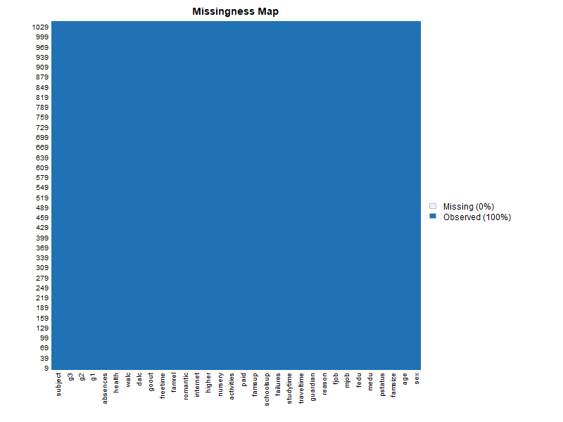
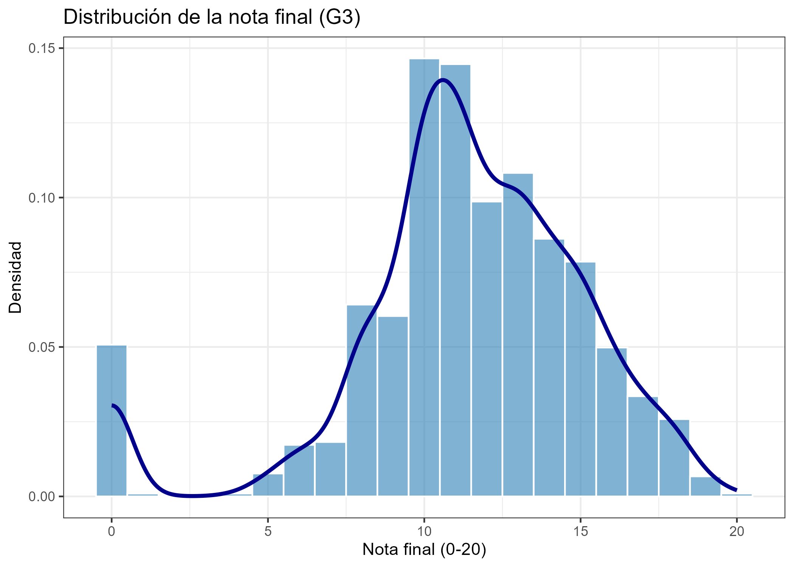
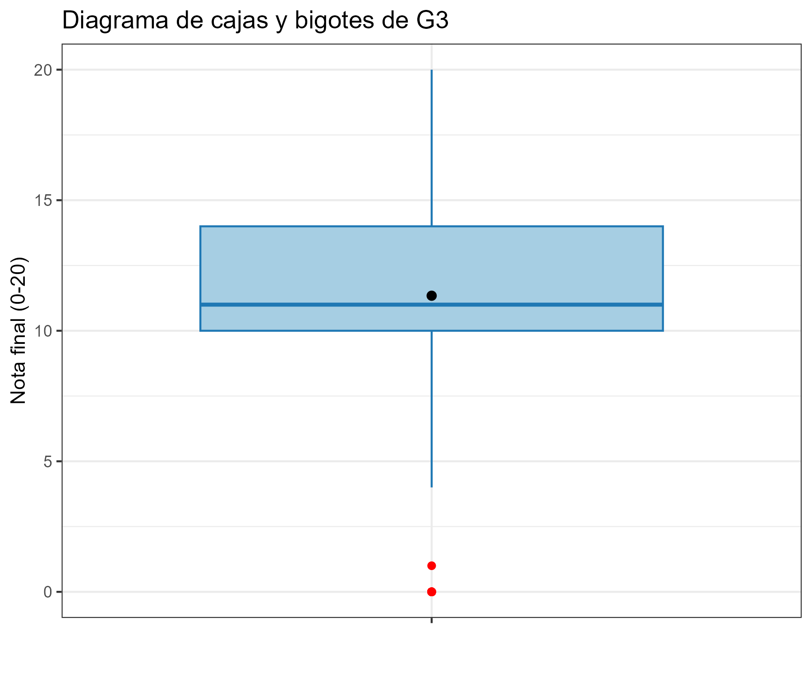
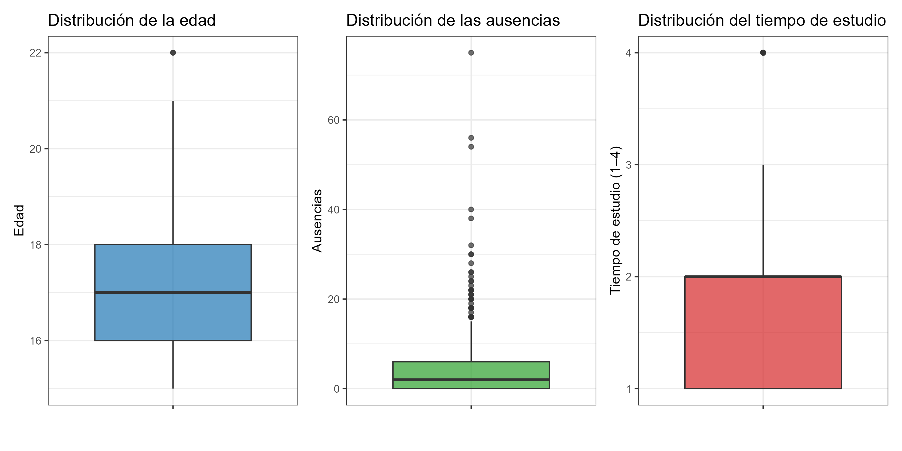
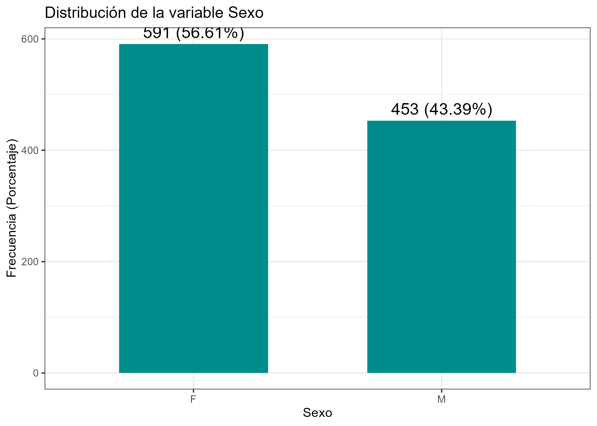

# 📊 Análisis Exploratorio de Datos — Estudiantes (Math & Portuguese)

Este repositorio contiene el análisis exploratorio de datos (EDA) aplicado a dos conjuntos de datos sobre rendimiento académico de estudiantes en Portugal. Los datasets provienen del UCI Machine Learning Repository y corresponden a estudiantes de **Matemáticas** y **Portugués**.

---

## 📂 Estructura de carpetas

```
├── data/        # Archivos CSV originales (student-mat.csv, student-por.csv)
├── images/      # Gráficos generados en el análisis
├── tables/      # Tablas exportadas en formato CSV
└── script.R     # Script único con todo el análisis
```

---

## 🔹 3.4.2 Extracción, Transformación y Carga (ETL)

Se unieron los datasets `student-mat.csv` y `student-por.csv` en un único dataframe.  
Se estandarizaron los nombres de las columnas y se eliminaron variables irrelevantes (`school`, `address`).

- **Mapa de valores perdidos**  
  

- **Tabla de NAs por columna**: [`na_table.csv`](tables/na_table.csv)

---

## 🔹 3.4.3 Análisis de la variable respuesta: G3

La variable **G3** representa la **nota final (0–20)**.  
A continuación, se muestran su distribución y estadísticas descriptivas.

- **Resumen estadístico**: [`resumen_g3.csv`](tables/resumen_g3.csv)

- **Histograma con densidad**  
  

- **Boxplot de G3**  
  

📌 **Interpretación:**  
La mayoría de los estudiantes obtiene notas entre 8 y 14, con ligera asimetría a la izquierda. Existen valores atípicos en ambos extremos.

---

## 🔹 3.4.4 Análisis de variables independientes

### 📈 Variables numéricas
Se analizaron **edad**, **ausencias** y **tiempo de estudio**.

- **Resumen estadístico**: [`resumen_variables_numericas.csv`](tables/resumen_variables_numericas.csv)

- **Boxplots comparativos**  
  

📌 **Interpretación:**  
- La edad se concentra entre 15 y 18 años.  
- Las ausencias presentan una distribución muy sesgada, con pocos estudiantes que acumulan muchas faltas.  
- El tiempo de estudio está concentrado en las categorías más bajas (1 y 2).

---

### 🧾 Variables categóricas
Se analizaron **sexo (sex)**, **apoyo escolar adicional (schoolsup)** y **actividades extraescolares (activities)**.

- **Frecuencias**: [`frecuencias_categoricas.csv`](tables/frecuencias_categoricas.csv)

- **Ejemplo: distribución por sexo**  
  

📌 **Interpretación:**  
La muestra está relativamente balanceada entre hombres y mujeres. La mayoría de estudiantes **no recibe apoyo escolar adicional**, aunque un número importante participa en actividades extracurriculares.

---

## 🔹 3.4.5 Análisis bivariado

### 🔗 G3 vs Variables Numéricas

- **G3 vs Edad**  
  

- **G3 vs Ausencias**  
  

- **G3 vs Tiempo de estudio**  
  

📌 **Interpretación:**  
- No existe relación fuerte entre la edad y la nota final.  
- Más ausencias tienden a asociarse con peores calificaciones.  
- Mayor tiempo de estudio muestra una ligera correlación positiva con mejores notas.

---

### 🔗 G3 vs Variables Categóricas

- **Distribución por sexo**  
  

- **Distribución por apoyo escolar**  
  

- **Distribución por actividades extracurriculares**  
  

- **Tabla de resumen**: [`analisis_bivariado.csv`](tables/analisis_bivariado.csv)

📌 **Interpretación:**  
- El sexo no muestra diferencias significativas en G3.  
- Los estudiantes con apoyo escolar tienden a obtener resultados ligeramente superiores.  
- La participación en actividades extracurriculares **no afecta drásticamente** el promedio final.

---

## 🔹 3.4.6 Análisis multivariado

Se utilizó **GGally** para visualizar relaciones entre múltiples variables.

- **Matriz de correlaciones**  
  

📌 **Interpretación:**  
Las correlaciones entre G3 y las variables numéricas son débiles, pero se observa un patrón claro en el impacto de las **ausencias** y **tiempo de estudio**.

---

## ✅ Conclusiones generales

1. La variable dependiente **G3** presenta una distribución normal sesgada con valores atípicos.  
2. **Ausencias** es una de las variables con mayor relación negativa con el rendimiento.  
3. El **tiempo de estudio** contribuye de manera positiva, aunque débil, a la mejora de las notas.  
4. El apoyo escolar muestra efectos favorables en los resultados académicos.  
5. No se evidencian grandes diferencias por sexo o actividades extracurriculares.


